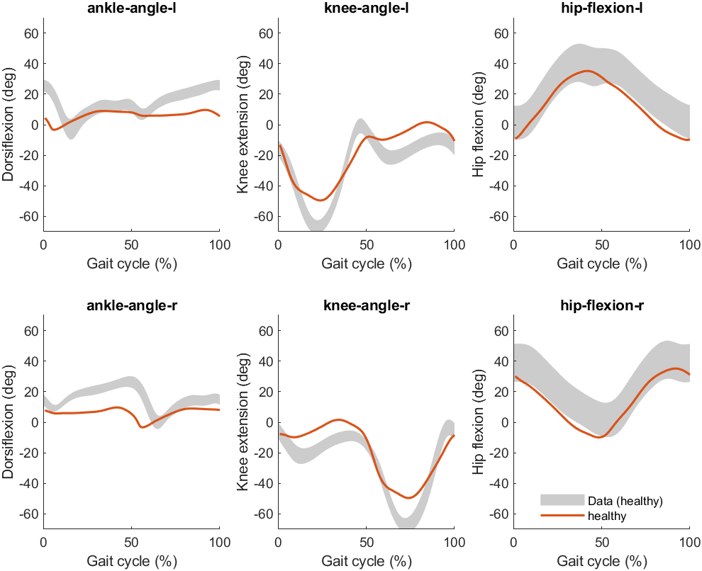
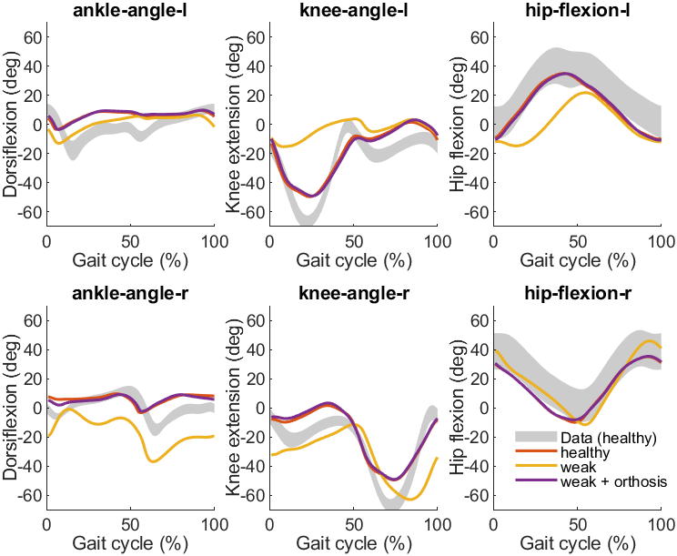

# Simulate the effects of an ankle-foot orthosis on gait patterns in individuals with dropfoot

Dropfoot (or dropfoot) is a gait abnormality in which the dropping of the forefoot happens out of weakness, irritation or damage to the deep fibular nerve or paralysis of the muscles in the anterior portion of the lower leg such as the tibialis anterior (e.g., [Stewart, 2008](https://pubmed.ncbi.nlm.nih.gov/18502948/)). It is usually a symptom of a greater problem, not a disease in itself. Dropfoot is characterized by inability or impaired ability to raise the toes or raise the foot from the ankle (i.e., dorsiflexion).

In this case study, you are going to investigate gait patterns associated with dropfoot in 2 steps:
1. Inducing weakness to the model's tibialis anterior muscle. After inducing weakness, you will predict the resulting gait pattern and its deviations from a healthy gait pattern.
2. Adding a passive ankle dorsiflexion ankle-foot orthosis to the model. After adding the ankle-foot orhosis, you will predict the resulting gait pattern. You will compare the predicted gait both with a healthy gait pattern, and with an abnormal gait pattern due to weakness of the tibialis anterior (obtained in Step 1). 

## Step 0: run a reference simulation with the 2D model
If you have not already done so, you need to run a reference simulation of healthy walking with the 2D model. Please follow the steps explained [here](https://github.com/KULeuvenNeuromechanics/PredSim-workshop-smalll-2025?tab=readme-ov-file#running-a-reference-2d-simulation-with-predsim).

## Step 1.1: induce weakness to the tibialis anterior
Next, you will induce weakness to the model's tibialis anterior. To do so, use the function `PredSim-workshop-smalll-2025/code/update_settings.m` to update the settings. In this function, add the following lines of code:

`strength_level = .05; % specify the strength level (0-1)`  
`S.subject.muscle_strength   = {{'tib_ant_r'}, strength_level};`  

This results in reducing the tibialis anterior strength of the right leg (`tib_ant_r`) to 5% of its default level. 

Next, in `Predsim/main.m`, on the (empty) line below `[S] = initializeSettings('gait1018');` (i.e. `line 21`), add the following line of code:

`S = update_settings(S);`

This is required to make sure that `Predsim` uses the updated settings.

## Step 1.2: simulate dropfoot during walking
You can now run a simulation with induced weakness of the tibialis anterior, simply by running the `Predsim/main.m` script. Once your simulation is done, the results are stored in `PredSimResults\gait1018` (as explained [here](https://github.com/KULeuvenNeuromechanics/PredSim-workshop-smalll-2025/blob/main/README.md#predsimresults)).

**bug fixing**: if you get an error saying `'update_settings' is not found in the current folder or on the MATLAB path`, run the script called `PredSim-workshop-smalll-2025\set_up_paths`. See [explanation](https://github.com/KULeuvenNeuromechanics/PredSim-workshop-smalll-2025/tree/main?tab=readme-ov-file#visualizing-your-simulation-results-in-opensim) for more details.

If all went well, you can now evaluate visualize the resulting gait pattern in OpenSim. Follow the instructions mentioned [here](https://github.com/KULeuvenNeuromechanics/PredSim-workshop-smalll-2025/tree/main?tab=readme-ov-file#visualizing-your-simulation-results-in-opensim). Note: if this is the second time you ran a simulation, the results are stored in files starting with `gait1018_v2`. 

You can also visualize the resulting joint angles by running the `PredSim-workshop-smalll-2025/S3 Dropfoot/Plotting/compare_devices.m` script. Before you run `compare_devices.m`, specify the versions we want to plot. To plot versions `v1` and `v2`, set `line 2` to:

`vs = [1, 2]`;

You should see the figure below: 

The grey lines show experimental data from a healthy participant (data source: [van der Zee et al., 2022](https://www.nature.com/articles/s41597-022-01817-1)). You may notice that there are differences between healthy data (grey) and the healthy simulation (red). These differences are in part due to using a 2D model instead of a (more accurate) 3D model. In addition, differences between simulation and data are also due to the fact that our understanding of human walking is currently incomplete. We are still actively improving our simulations to yield better agreement with experimental data (e.g. [d'Hondt et al., 2024](https://journals.plos.org/ploscompbiol/article?id=10.1371/journal.pcbi.1012219); [Afschrift et al., 2025](https://journals.plos.org/ploscompbiol/article?id=10.1371/journal.pcbi.1012713)). Despite differences with data, the healthy simulation (red) generally matches data (grey) better than the simulation with imposed weakness of the tibialis anterior (yellow). Most noticable difference occurs for:
-   Right ankle: weak (yellow) has smaller (i.e. more negative) ankle angles, which correspond to more plantar flexion. This is due to the tibialis anterior weakness.
-   Right knee: weak (yellow) has smaller (i.e. more negative) knee angles, which correspond to more flexion. This may be a compensation to make sure the foot clears the ground during swing.
-   Left knee: weak (yellow) has larger (i.e. more positive) knee angles, which correspond to more extension. This may be a compensation to help ground clearance of the right foot during swing.

## Step 2.1: add an ankle-foot orthosis to the model
After inducing weakness in Step 1, you are now ready to try and normalize the gait pattern by adding an ankle-foot orthosis to the model. Like before, you can use the function `PredSim-workshop-smalll-2025/code/update_settings.m` to adjust the model and accomplish this. In this function, add the following lines of code:

`exo1.ankle_stiffness = 2; % ankle stiffness in Nm/deg`  
`exo1.left_right = 'r'; % 'l' for left or 'r' for right`  
`exo1.function_name = 'ankleExoDorsi';`  
`exo1.ankle_offset = 15; % neutral ankle angle in deg `   
`S.orthosis.settings{1} = exo1;`

This adds an exoskeleton with a stiffness of 2 Nm/deg and a neutral ankle angle of 15 deg dorsiflexion to the right foot. The mass of the exoskeleton is ignored for simplicity. 

## Step 2.2: simuluate the effects of an ankle-foot orthosis on gaits in individuals with dropfoot
You can now run a simulation by running the `Predsim/main.m` script. Once your simulation is done, the results are stored in `PredSimResults\gait1018`. 

If all went well, you can visualize the resulting gait pattern in OpenSim. Follow the instructions mentioned [here](https://github.com/KULeuvenNeuromechanics/PredSim-workshop-smalll-2025/tree/main?tab=readme-ov-file#visualizing-your-simulation-results-in-opensim). Note: if this is the third time you ran a simulation, the results are stored in files starting with `gait1018_v3`. **Invisible ankle-foot orthosis**: at the moment, it is not possible yet to visualize the ankle-foot orthosis itself in OpenSim, only its effects on gait. 

Like before, you can visualize the joint angles using the `PredSim-workshop-smalll-2025/S3 Dropfoot/Plotting/compare_devices.m` script. Before you run `compare_devices.m`, specify the versions we want to plot. To plots `v1`, `v2` and `v3`, set `line 2` to:

`vs = [1, 2, 3]`;

You should see the figure below:

The grey, red and yellow lines are the same as before. The simulation with weakness and the ankle-foot orthosis is shown in purple. There are still differences with the simulated healthy gait (red), but these are smaller than the differences with the gait with imposed weakness (yellow). Thus, adding the ankle-foot orthosis reduced gait deviations.

## Optional Step 2.3: test different stiffnesses and/or neutral angles of the ankle-foot orthosis
If you want, you can change the weakness level, ankle-foot orthosis stiffness and/or neutral  angle to gain more insight into the effect of weakness and/or assitive devices. To do so, adjust the following lines of code in `PredSim-workshop-smalll-2025/code/update_settings.m`:

`strength_level = .05; % specify the strength level (0-1)`  
`exo1.ankle_stiffness = 2; % ankle stiffness in Nm/deg`   
`exo1.ankle_offset = 15; % neutral ankle angle in deg ` 

Replace (one of) the numbers `.05` `2` and `15` with (a) number(s) of your choosing. Repeat Step 2.2 to simulate the resulting gait pattern. 
