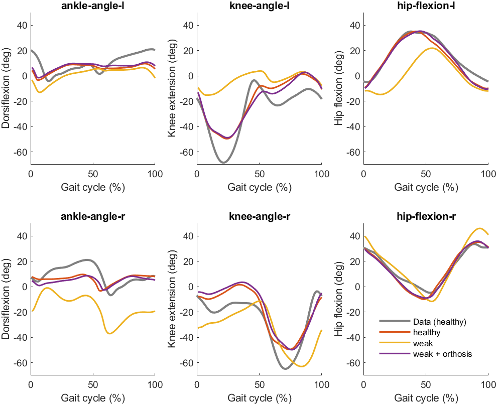

# Simulate the effects of an ankle-foot orthosis on gait patterns in individuals with foot drop

Foot drop is a gait abnormality in which the dropping of the forefoot happens out of weakness, irritation or damage to the deep fibular nerve or paralysis of the muscles in the anterior portion of the lower leg such as the tibialis anterior. It is usually a symptom of a greater problem, not a disease in itself. Foot drop is characterized by inability or impaired ability to raise the toes or raise the foot from the ankle (dorsiflexion).

In this case study, you are going to investigate gait patterns associated with foot by:
1. Modeling weakness of the tibialis anterior. You will predict the gait pattern associated with this weakness, and compare it to a healthy gait pattern.
2. Modeling the effect of a passive ankle-foot orthosis that delivers ankle dorsiflexion torque. You will predict the gait pattern associated with using this assitive device in combination with weakness of the tibialis anterior, and compare to a gait pattern with weakness of the tibialis anterior but without using the ankle-foot orthosis.

## Step 1: run a reference simulation with the 2D model
Make sure you have PredSim and associated dependencies installed (see https://github.com/KULeuvenNeuromechanics/PredSim). We will be using the 2D model called `gait1018`. Because PredSim is using the 3D model by default, we need to make a small adjustment to the main.m script. On `line 20` and `line 25` of `PredSim/main.m`, change `'Falisse_et_al_2022'` with `'gait1018'`. See the [documentation of PredSim](https://github.com/KULeuvenNeuromechanics/PredSim) for further information.

You can now run a simulation with the 2D model, simply by running the `Predsim/main.m` script. Once your simulation is done, the results are stored in `PredSimResults\gait1018`. If this is the first time you ran a simulation, the results are stored in files starting with `gait1018_v1`. The following files are created:
- `gait1018_v1.mat`: contains all the output variables that can be processed and visualized using MATLAB
- `gait1018_v1.mot`: contains the motion files of the simulation, which can be visualized using OpenSim
- `gait1018_v1_log.txt`: contains the logged information about the simulation

## Step 2: induce weakness of the tibialis anterior
The function `PredSim-workshop-smalll-2025/code/update_settings.m` may be used to update the settings. In this function, add the following lines of code:

`strength_level = .05; % specify the strength level (0-1)`  
`S.subject.muscle_strength   = {{'tib_ant_r'}, strength_level};`  
`S.misc.gaitmotion_type = 'FullGaitCycle';`

This results in reducing the tibialis anterior strength of the right leg (`tib_ant_r`) to 5% of its default level. Next, replace `line 21` of `Predsim/main.m` (currently empty) with the following line of code:

`S = update_settings(S);`

Make sure `update_settings` is added to your path. Run the script called `PredSim-workshop-smalll-2025\set_up_paths`;

## Step 3: simulate foot drop during walking
You can now run a simulation with the 2D model, simply by running the `Predsim/main.m` script. Once your simulation is done, the results are stored in `PredSimResults\gait1018`. If this is the second time you ran a simulation, the results are stored in files starting with `gait1018_v2`. You can now evaluate the effect of weakness by running the `PredSim-workshop-smalll-2025/Sx Foot drop case/Plotting/compare_devices.m` script. 

Before you run `compare_devices.m`, specify the versions we want to plot. To plots `v1` and `v2`, set `line 2` to:

`vs = [1, 2]`;

You should see the figure below: 

You may notice that healthy (red) generally matches Data better than weak (yellow). This is because this data is from a healthy participant. Most noticable difference occurs for:
-   Right ankle: weak (yellow) has smaller (i.e. more negative) ankle angles, which correspond to more plantar flexion. This is due to the TA weakness
-   Right knee: weak (yellow) has smaller (i.e. more negative) knee angles, which correspond to more flexion. This may be a compensation to make sure the foot clears the ground during swing.
-   Left knee: weak (yellow) has larger (i.e. more positive) knee angles, which corerspond to more extension. This may be a compensation to help ground clearance of the right foot during swing.

## Step 4: add an ankle-foot orthosis to the model
The function `PredSim-workshop-smalll-2025/code/update_settings.m` may be used to update the settings. In this function, add the following lines of code:

`exo1.ankle_stiffness = 0; % ankle stiffness in Nm/rad`  
`exo1.left_right = 'r'; % 'l' for left or 'r' for right`  
`exo1.function_name = 'ankleExoDorsi';`  
`S.orthosis.settings{1} = exo1;`

This adds an exoskeleton with a stiffness of 0 Nm/rad to the right foot. The mass of the exoskeleton is ignored for simplicity. Because the default stiffness is 0, the exoskeleton should not affect the gait pattern. Change the stiffness to a desired level (greater than 0). 

## Step 5: simuluate the effects of an ankle-foot orthosis on gaits in individuals with foot drop
You can now run a simulation with the 2D model, simply by running the `Predsim/main.m` script. Once your simulation is done, the results are stored in `PredSimResults\gait1018`. If this is the third time you ran a simulation, the results are stored in files starting with `gait1018_v3`. You can now evaluate the combined effects of weakness and the assitive device by running the `PredSim-workshop-smalll-2025/Sx Foot drop case/Plotting/compare_devices.m` script. Before you run `compare_devices.m`, specify the versions we want to plot. To plots `v1`, `v2` and `v3`, set `line 2` to:

`vs = [1, 2, 3]`;

You should see the figure below:

The results with and without ankle-foot orthosis are similar, because the stiffness was set to 0 Nm.deg.

## Step 6: test different stiffnesses of the ankle-foot orthosis
At this time, the ankle-foot orthosis has not done anything, because the stiffness was set to 0 Nm/deg. In `PredSim-workshop-smalll-2025/code/update_settings.m`, adjust the following line of code to test the effect of an exoskeleton with a different stiffness:

`exo1.ankle_stiffness = ; % ankle stiffness in Nm/rad`

Repeat Steps 5-6 until the gait pattern with TA weakness better resembles a healthy gait pattern.

## Step 7: visualize results in OpenSim

